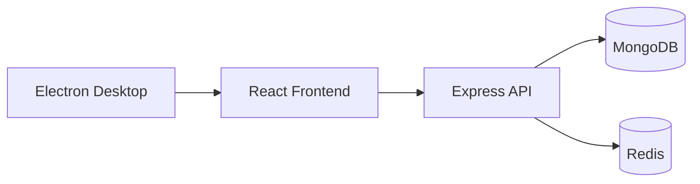
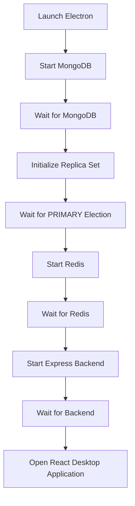
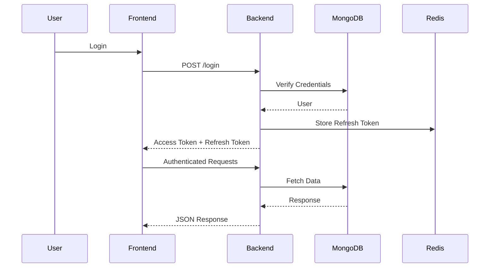

# BillBo Plastic Surgery

> A modern desktop Electronic Medical Records (EMR) system for plastic surgery practices, built with Electron, React, TypeScript, Node.js, Express, MongoDB, and Redis.

<p align="center">
  
</p>

---

## 📖 Overview

BillBo Plastic Surgery is a full-stack desktop application designed to help plastic surgeons securely manage patient records, medical histories, surgical procedures, medications, and clinical workflows.

Unlike traditional web applications, BillBo runs entirely as a native desktop application using **Electron**, while embedding its own backend services, MongoDB database, and Redis server. Users only need to install the application—no additional software installation is required.

The application demonstrates production-oriented backend engineering, secure authentication, embedded infrastructure management, and modern desktop application architecture.

---

# ✨ Features

### 🩺 Patient Management

- Create patients
- View patient records
- Update patient information
- Delete patient records

### 📋 Medical Records

- Medical history
- Surgical history
- Medicines
- Diagnoses
- Procedures
- Clinical notes

### 🔐 Authentication & Security

- JWT Authentication
- Access Tokens
- Refresh Tokens
- Secure Password Hashing
- Protected API Routes
- Role-based Authorization

### 💻 Desktop Application

- Electron Desktop Application
- Embedded Backend Server
- Embedded MongoDB
- Embedded Redis
- Offline-first Architecture

### ⚙ Infrastructure

- Automatic MongoDB Startup
- Automatic Replica Set Initialization
- Automatic PRIMARY Election Detection
- Automatic Redis Startup
- Graceful Shutdown
- Production Packaging

---

# 🛠 Tech Stack

## Frontend

- React
- TypeScript
- React Router
- Tailwind CSS
- Fetch

## Backend

- Node.js
- Express.js
- TypeScript
- MongoDB
- Mongoose
- Redis
- JWT Authentication
- bcrypt

## Desktop

- Electron
- Node Child Processes

---

# 🏗 System Architecture



---

# 🚀 Application Startup Flow

One of the unique features of this project is its automatic infrastructure startup.

When the application launches, Electron performs the following startup sequence:



This guarantees that:

- MongoDB is running
- Replica Set is fully initialized
- PRIMARY has been elected
- Redis is available
- Backend API is ready

before the desktop application becomes available.

---

# 🔒 Authentication Flow



---

# 📂 Project Structure

```
BillBo/

│

├── client/             # React Frontend

├── server/             # Express Backend

├── electron/           # Electron Main Process

├── docs/               # Images & Documentation

│

├── README.md

└── package.json
```

---

# 📸 Screenshots

## Login


---

## Dashboard


---

## Patient Details


---

## Medical Records


---

# 🚀 Getting Started

## Clone Repository

```bash
git clone https://git@github.com:Mwesigye-Nicholas/billbo-plaster-surgery_version_02.git

cd billbo-plastic-surgery
```

---

## Install Dependencies

```bash
npm install
```

---

## Development

```bash
npm run dev
```

---

## Build

```bash
npm run build
```

---

## Package Desktop Application

```bash
npm run package
```

---

# 📚 Documentation

Additional documentation is available inside each project folder.

| Folder | Description |
|---------|-------------|
| client | React frontend documentation |
| server | Express backend documentation |

---

# 🚧 Future Improvements

- Audit Logs
- Automatic Updates
- Database Backup & Restore
- Multi-user Synchronization
- Cloud Sync

---

# 🎯 Project Goals

This project demonstrates knowledge of:

- Full Stack Development
- Desktop Application Development
- REST API Design
- Authentication
- Authorization
- MongoDB
- Redis
- Electron
- TypeScript
- Infrastructure Automation
- Production Application Packaging
- Error Handling
- Secure Software Development

---

# 📄 License

This project is licensed under the MIT License.

---

# 👨‍💻 Author

**Mwesigye Nicholas**

Full Stack Software Developer

- Node.js
- TypeScript
- React
- Electron
- MongoDB
- Express
- PostgreSQL

Feel free to connect or reach out regarding software development opportunities or collaboration.